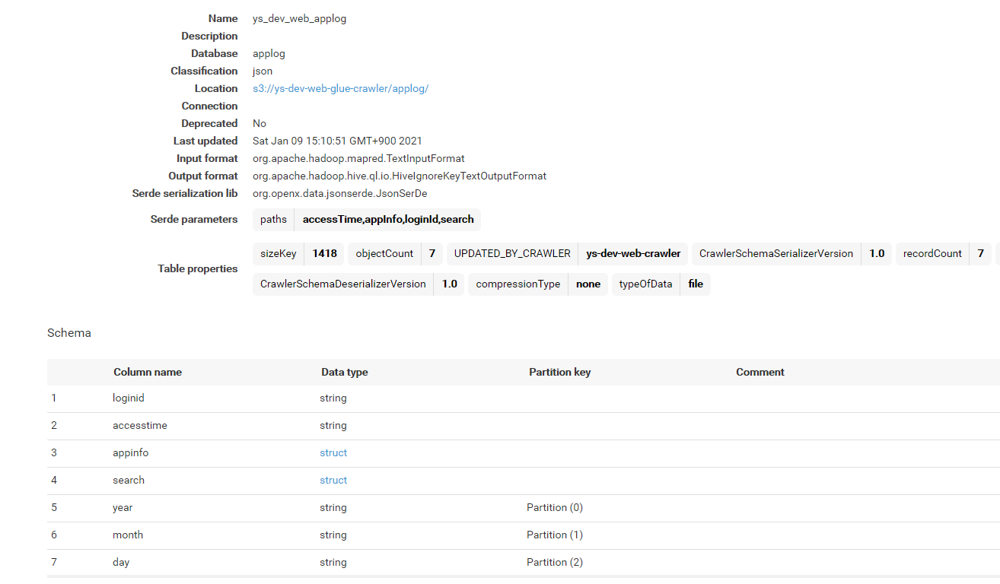

# 概要
S3上にあるログ（JSON）を、Glue Crawlerでスキーマおよびパーティションを自動作成し、  
Athenaでクエリできるようにするまでのサンプル。

# 手順
## 事前準備
1. S3 Bucketの作成
    * 名前は任意で良い。ここでは、`ys-dev-web-glue-crawler`としておく。
1. JSONログのフォーマット
    * ネストしたJSONを試したかったので、以下のようなログとした。（スマホアプリの検索ログみたいなイメージ）
    * 説明上成形しているが、`s3上には改行を含まない（1行の）JSONにする`こと。Athenaクエリ時にフォーマットエラーになってしまう。  
        ```json
        {
          "loginId": "user-1",
          "accessTime": "2021-01-01T00:00:00Z",
          "appInfo": {
            "version": "1.0.0",
            "os": "android 9.0"
          },
          "search": {
            "category": "restaurant",
            "word": "beef"
          }
        } 
        ```
1. JSONログのアップロード
    * Glue Crawlerでパーティションとして認識されるように、以下のパスにアップロードした。（中身は適当に変更した。）
        * applog/year=2021/month=01/day=01/0001.json
        * applog/year=2021/month=01/day=01/0002.json
        * applog/year=2021/month=01/day=01/0003.json
        * applog/year=2021/month=01/day=02/0001.json
        * applog/year=2021/month=01/day=02/0002.json
        * applog/year=2021/month=02/day=01/0001.json
        * applog/year=2021/month=02/day=01/0002.json

## Glue Crawlerの作成
1. CloudFormation.templateにて作成。
[glue-crawler.yml](./glue-crawler.yml)
2. AWSコンソールで、上記templateからCloudFormation Stackを作成。  
3. Glue Crawlerが5分毎に動くようになっているため、しばし待つ。
    * Glueコンソールから実行結果やログを確認できるので、上手く動いていなければそこを確認する。

## テーブル定義の確認
AWSコンソールから確認し、以下のようにスキーマとパーティションが認識されていればOK。  


## Athenaでクエリ
Athenaのコンソールから、以下のようなクエリが実行できれば正しくテーブルが作成されている。
* 全件取得
    ```sql
    SELECT * FROM "applog"."ys_dev_web_applog";
    ```
* loginId毎のアクセス数を取得
    ```sql
    SELECT loginid, count(loginid) as accessNum FROM "applog"."ys_dev_web_applog"
    GROUP BY loginid
    ```
* versionとosのユニークな組み合わせを取得
    ```sql
    SELECT appinfo.os, appinfo.version FROM "applog"."ys_dev_web_applog"
    GROUP BY appinfo.os, appinfo.version
    ```
  
# おまけ
## 別アカウントのs3を参照する場合
昨今では、データレイク用のAWSアカウントを別にしていることも多い。  
s3にクロスアカウントでアクセスする場合には、以下のようなBucket Policyを設定する。  
```json
{
    "Version": "2012-10-17",
    "Statement": [
        {
            "Effect": "Allow",
            "Principal": {
                "AWS": "arn:aws:iam::243062585824:root"
            },
            "Action": "s3:GetObject",
            "Resource": "arn:aws:s3:::ys-dev-web-glue-crawler/*"
        },
        {
            "Effect": "Allow",
            "Principal": {
                "AWS": "arn:aws:iam::243062585824:root"
            },
            "Action": "s3:ListBucket",
            "Resource": "arn:aws:s3:::ys-dev-web-glue-crawler"
        }
    ]
}
```