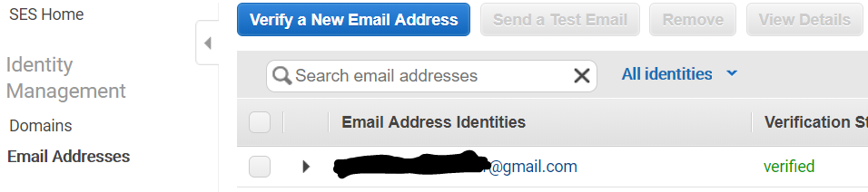
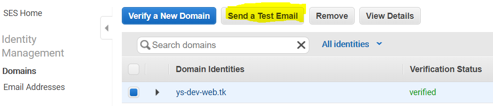

# Summary
It is sample which send email with SES.
Domain registration are used Route53 and free domain.

# Procedure
## Create Route53 Hosted Zone
* Create Route53 domain.
* Because of using later, please memo NS records which are created automatically.
## Create DNS Domain
* Create DNS domain in freenom.com.
    * https://my.freenom.com
* Need to select custom nameservers.
* Input NS records above.

## Create SES Domain
* Create SES domain
    * Check on DKIM
* Create CNAME records and TXT record in Route53.
* Until verification status is verified, please wait.
## Send Test Mail
* Need to verifiy email address in advance, becase it is sandbox environment.   
  
  
# Implement Lambda Function
## Code
```
import json
import boto3

from_address = 'xxxxxx@ys-dev-web.tk'
to_address = 'xxxxxx@gmail.com'
subject = 'test000'
message = 'テストのメールだよ。'
client = boto3.client('ses',region_name='us-west-2')

def lambda_handler(event, context):
    response = client.send_email(
        Destination={
            'ToAddresses': [
                to_address,
            ],
        },
        Message={
            'Body': {
                'Text': {
                    'Charset': 'UTF-8',
                    'Data': message,
                },
            },
            'Subject': {
                'Charset': 'UTF-8',
                'Data': subject,
            },
        },
        Source=from_address
    )
    return {
        'statusCode': 200,
        'body': json.dumps('Hello from Lambda!')
    }

```